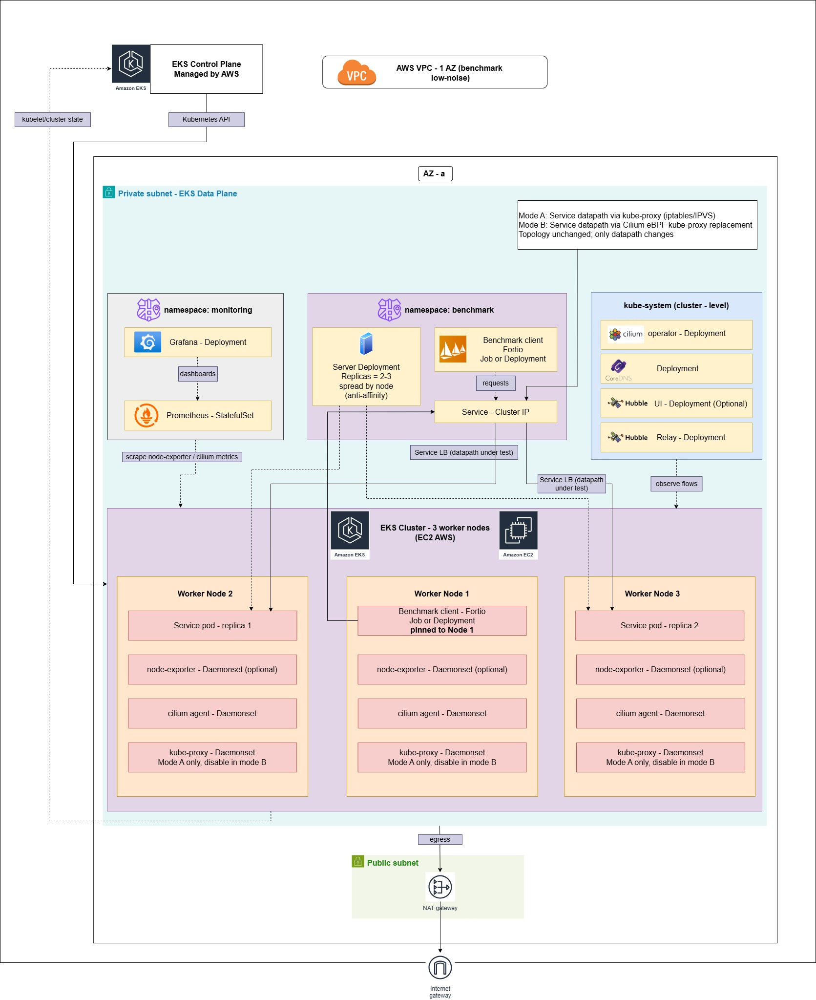

# thesis-cilium-eks-benchmark

## Tổng quan dự án

Đây là repo **benchmark so sánh hiệu năng datapath mạng Kubernetes** trong khuôn khổ
luận văn NT531. Mục tiêu là đo và so sánh **2 mode datapath** trên cùng hạ tầng EKS:

| Mode | Tên | Mô tả |
|------|-----|-------|
| **A** | kube-proxy baseline | Cilium CNI hoạt động cùng kube-proxy (iptables). Đây là baseline. |
| **B** | Cilium eBPF KPR | Cilium thay thế hoàn toàn kube-proxy bằng eBPF (`kubeProxyReplacement: true`). |

**Workload:** Fortio (load generator) → echo server (HTTP echo) qua ClusterIP Service.

**3 kịch bản đo:**
- **S1 — Service Baseline:** Steady-state load, không policy.
- **S2 — High-load + Connection Churn:** Multi-phase stress (ramp-up → sustained → burst → cool-down), keepalive off.
- **S3 — NetworkPolicy Overhead:** Policy OFF → policy ON, đo overhead enforcement.

**3 mức tải:** L1 (light) / L2 (medium) / L3 (high) — được calibrate trước khi chạy chính thức.

> Chi tiết thiết kế thí nghiệm: `docs/experiment_spec.md`
> Hướng dẫn chạy: `docs/runbook.md`

---

## Kiến trúc hệ thống

### Topology tổng quan

<!-- Chèn ảnh kiến trúc hệ thống tại đây -->


Hệ thống benchmark được triển khai trên **AWS EKS** với kiến trúc như sau:

**Hạ tầng AWS:**
- **VPC** `10.0.0.0/16` với 2 Availability Zones (AZs), mỗi AZ có 1 public subnet + 1 private subnet.
- **EKS Cluster** (Kubernetes 1.34) với Managed Node Group gồm **3 worker nodes** `m5.large` (2 vCPU, 8GB RAM, non-burstable).
- Worker nodes được **pin vào 1 AZ duy nhất** để giảm nhiễu latency cross-AZ trong quá trình đo.
- Node group cố định `min = desired = max = 3`, **không autoscale** trong lúc benchmark.

**Workload benchmark (namespace `benchmark`):**
- **Echo server** (`hashicorp/http-echo:1.0`) — HTTP echo backend, expose qua **ClusterIP Service** (`echo.benchmark:80 → 5678`).
- **Fortio client** (`fortio/fortio:1.74.0`) — load generator chạy trong cluster, gửi request đến echo qua Service.
- Cả 2 pods đều có `nodeSelector: role: benchmark` và resource requests/limits để đảm bảo tính công bằng.

**CNI & Datapath (biến độc lập chính):**
- **Mode A — kube-proxy baseline:** Cilium làm CNI, kube-proxy xử lý Service routing bằng iptables (DNAT/SNAT).
- **Mode B — Cilium eBPF KPR:** Cilium thay thế hoàn toàn kube-proxy (`kubeProxyReplacement: true`), Service routing được xử lý trực tiếp ở tầng eBPF (socket-level redirect), bypass iptables.

**Monitoring & Observability:**
- **Prometheus + Grafana** (kube-prometheus-stack) — thu thập metrics CPU, memory, network từ nodes và pods.
- **Hubble** (Mode B) — observability layer của Cilium, cung cấp flow-level visibility (FORWARDED/DROPPED verdicts).

**NetworkPolicy (Scenario S3):**
- `CiliumNetworkPolicy` allow Fortio → Echo + default-deny ingress cho echo pod.
- Dùng để đo overhead khi bật policy enforcement so với không có policy.

### Datapath so sánh

```
┌─────────────────────────────────────────────────────────────────────┐
│                        AWS EKS Cluster (1 AZ)                       │
│                     Kubernetes 1.34 · 3× m5.large                   │
│                                                                     │
│  ┌──────────────┐                           ┌──────────────┐        │
│  │  Fortio Pod   │──── ClusterIP Service ───▶│  Echo Pod    │        │
│  │  (client)     │     echo.benchmark:80       │  (server)    │        │
│  │  ns: benchmark│                           │  ns: benchmark│        │
│  └──────────────┘                           └──────────────┘        │
│         │                                          │                │
│         ▼                                          ▼                │
│  ╔══════════════════════════════════════════════════════════════╗    │
│  ║  Mode A (Baseline)        │  Mode B (eBPF KPR)             ║    │
│  ║  ─────────────────        │  ──────────────────             ║    │
│  ║  Cilium CNI               │  Cilium CNI                    ║    │
│  ║  + kube-proxy (iptables)  │  + kubeProxyReplacement: true  ║    │
│  ║  → iptables DNAT/SNAT     │  → eBPF socket-level redirect  ║    │
│  ╚══════════════════════════════════════════════════════════════╝    │
│                                                                     │
│  ┌───────────────────────────────────────────────────────────┐      │
│  │  Observability: Prometheus + Grafana + Hubble (Mode B)    │      │
│  └───────────────────────────────────────────────────────────┘      │
└─────────────────────────────────────────────────────────────────────┘
```

---

## Project Structure

```
thesis-cilium-eks-benchmark/
├── README.md                          # File này — tổng quan dự án
├── .gitignore                         # Ignore rules (results, tfstate, logs…)
├── Makefile                           # Lệnh tiện ích: fmt, lint
│
├── docs/                              # Tài liệu thiết kế & vận hành
│   ├── experiment_spec.md             #   Đặc tả thí nghiệm (metrics, scenarios, protocol)
│   ├── runbook.md                     #   Hướng dẫn chạy benchmark từng bước
│   └── images/                        #   Hình ảnh kiến trúc, topology, diagrams
│
├── terraform/                         # IaC — provision hạ tầng AWS
│   ├── main.tf                        #   Entry point — gọi modules VPC + EKS
│   ├── variables.tf                   #   Input variables
│   ├── outputs.tf                     #   Output values (cluster endpoint, kubeconfig command)
│   ├── envs/dev/terraform.tfvars      #   Biến cho môi trường dev
│   └── modules/
│       ├── vpc/                       #   VPC module (10.0.0.0/16, 2 AZs; workers pinned to 1st AZ)
│       │   ├── main.tf, variables.tf, outputs.tf
│       └── eks/                       #   EKS module (m5.large × 3, managed node group)
│           ├── main.tf, variables.tf, outputs.tf
│
├── helm/                              # Helm values cho CNI + monitoring
│   ├── cilium/
│   │   ├── values-baseline.yaml       #   Mode A: kubeProxyReplacement=false
│   │   └── values-ebpfkpr.yaml        #   Mode B: kubeProxyReplacement=true
│   └── monitoring/
│       ├── values.yaml                #   kube-prometheus-stack (placeholder)
│       └── dashboards/                #   Grafana dashboard JSON exports
│
├── workload/                          # Kubernetes manifests cho benchmark
│   ├── server/
│   │   ├── 01-namespace.yaml          #   Namespace "benchmark"
│   │   ├── 02-echo-deploy.yaml        #   hashicorp/http-echo:1.0 (resource limits + nodeSelector)
│   │   └── 03-echo-svc.yaml           #   ClusterIP port 80 → 5678
│   ├── client/
│   │   └── 01-fortio-deploy.yaml      #   fortio/fortio:1.74.0 (resource limits + nodeSelector)
│   └── policies/
│       ├── 01-cilium-policy-allow-fortio-to-echo.yaml
│       └── 02-cilium-policy-deny-other.yaml  # Default-deny ingress (S3)
│
├── scripts/                           # Shell scripts tự động hóa benchmark
│   ├── common.sh                      #   Thư viện dùng chung (validation, Fortio, evidence)
│   ├── run_s1.sh                      #   S1: Service Baseline (steady-state)
│   ├── run_s2.sh                      #   S2: High-load + Connection Churn (4 phases)
│   ├── run_s3.sh                      #   S3: NetworkPolicy OFF → ON
│   ├── collect_meta.sh                #   Standalone kubectl evidence collector
│   └── collect_hubble.sh              #   Standalone Cilium/Hubble evidence collector
│
├── results/                           # Output artifacts (theo Results Contract)
│   ├── README.md                      #   Quy ước cấu trúc output bắt buộc
│   └── metadata.template.json.txt     #   Template cho metadata.json mỗi run
│
└── report/                            # Tài liệu báo cáo / luận văn
    ├── result_summary.md              #   Template bảng tổng hợp kết quả
    ├── figures/dashboards/            #   Screenshots Grafana
    ├── tables/                        #   Bảng CSV/LaTeX
    └── appendix/                      #   Phụ lục: config, logs
```

---

## Prerequisites

- **AWS CLI** + credentials (`aws configure`)
- **kubectl** (>= 1.28)
- **helm** (>= 3.x)
- **terraform** (>= 1.5)
- **bash** (>= 4.0, trên WSL/Linux)
- (optional) `jq`, `hubble` CLI

---

## Quick Start

### 1) Provision EKS

```bash
cd terraform
terraform init
terraform plan -var-file=envs/dev/terraform.tfvars
terraform apply -var-file=envs/dev/terraform.tfvars
```

### 2) Configure kubeconfig

```bash
# Lấy command từ terraform output
$(terraform output -raw kubeconfig_command)
kubectl get nodes   # 3 nodes Ready
```

### 3) Install Cilium (chọn Mode)

```bash
helm repo add cilium https://helm.cilium.io && helm repo update
```

**Mode A** (kube-proxy baseline):
```bash
helm upgrade --install cilium cilium/cilium \
  -n kube-system --version 1.18.7 \
  -f helm/cilium/values-baseline.yaml
```

**Mode B** (eBPF KPR — kube-proxy-free):
```bash
# Điền k8sServiceHost trong values-ebpfkpr.yaml trước
# Lấy endpoint: terraform output cluster_endpoint
helm upgrade --install cilium cilium/cilium \
  -n kube-system --version 1.18.7 \
  -f helm/cilium/values-ebpfkpr.yaml
```

### 4) Deploy workload

```bash
kubectl apply -f workload/server/
kubectl apply -f workload/client/
# Verify
kubectl -n benchmark get pods   # echo + fortio Running
```

### 5) Run benchmarks

```bash
# S1 — Mode A, Load L1, 3 lần lặp
MODE=A LOAD=L1 REPEAT=3 ./scripts/run_s1.sh

# S2 — Mode B, Load L2, 3 lần lặp
MODE=B LOAD=L2 REPEAT=3 ./scripts/run_s2.sh

# S3 — Mode B, Load L2, policy toggle
MODE=B LOAD=L2 REPEAT=3 ./scripts/run_s3.sh
```

> Chi tiết đầy đủ: `docs/runbook.md`

---

## Results Contract

Mỗi run tự động tạo artifacts theo convention:

```
results/
  mode=A_kube-proxy/
    scenario=S1/
      load=L1/
        run=R1_2026-02-27T14-30-00+07-00/
          bench.log             # Fortio output (latency, RPS, errors)
          metadata.json         # Run config (từ template)
          checklist.txt         # Runner/Checker validation
          kubectl_get_all.txt   # kubectl get all -A
          kubectl_top_nodes.txt # kubectl top nodes
          events.txt            # kubectl get events
          cilium_status.txt     # (Mode B / S3)
          hubble_status.txt     # (Mode B / S3)
          hubble_flows.jsonl    # (Mode B / S3)
```

> Xem chi tiết: `results/README.md`

---

## Key Environment Variables

| Variable | Default | Mô tả |
|----------|---------|-------|
| `MODE` | `A` | `A` = kube-proxy, `B` = Cilium eBPF KPR |
| `LOAD` | `L1` | `L1` (light), `L2` (medium), `L3` (high) |
| `REPEAT` | `3` | Số lần lặp mỗi (scenario × load) |
| `DURATION_SEC` | `180` | Thời gian đo chính thức (giây) — tối thiểu 3 phút |
| `WARMUP_SEC` | `30` | Thời gian warm-up (giây) |
| `REST_BETWEEN_RUNS` | `60` | Nghỉ giữa các runs (giây) |

Xem tất cả biến: `scripts/README.md`

---

## Notes

- **Không autoscale** nodegroup trong lúc đo — `min=desired=max=3` (tránh nhiễu).
- **Workers pinned 1 AZ** — tất cả benchmark nodes nằm trên cùng 1 AZ để giảm nhiễu liên AZ (plan §2.3).
- **Resource limits** đã set cho cả Fortio và echo pods (tránh CPU throttling — plan §2.3).
- **nodeSelector `role: benchmark`** trên cả 2 workload pods (plan §4.5).
- Mỗi case chạy **≥ 3 runs**, nghỉ **60s** giữa các runs.
- Measurement duration: **180s** (3 phút) — plan §4.3.
- Scripts fail-fast nếu kubectl context sai hoặc pods chưa Ready.
- Trên Linux/WSL: `chmod +x scripts/*.sh` trước khi chạy.
