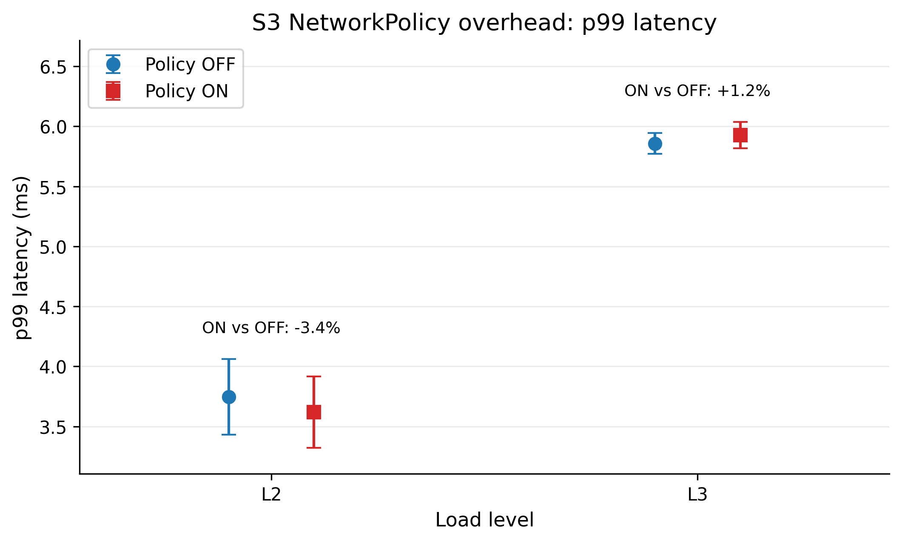
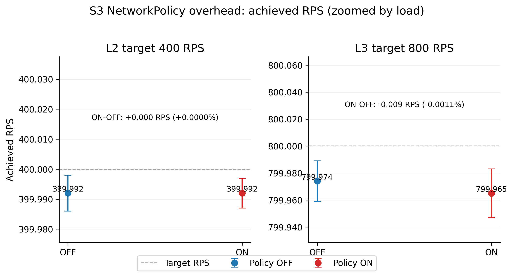

# Phân tích S3 - NetworkPolicy overhead

## 1. Mục tiêu của S3

S3 là phần benchmark dùng để đánh giá chi phí hiệu năng khi bật NetworkPolicy trong Mode B. Khác với S1 và S2, S3 không phải là so sánh Mode A với Mode B. Đơn vị so sánh thực tế của S3 là:

- **Mode B, policy OFF**: Cilium eBPF kube-proxy replacement, chưa áp dụng CiliumNetworkPolicy.
- **Mode B, policy ON**: cùng datapath Mode B, có CiliumNetworkPolicy được áp dụng.

Mục tiêu kỹ thuật của S3 là đo xem policy enforcement có làm tăng latency, đặc biệt là p99, hay không. Từ góc nhìn đánh giá hiệu năng mạng, đây là câu hỏi về overhead của lớp kiểm soát bảo mật: khi datapath phải kiểm tra policy, tail latency có tăng đáng kể không, throughput có bị ảnh hưởng không, và error rate có thay đổi không.

S3 khác S1 và S2 ở hai điểm chính:

- S1 đo steady-state latency giữa hai mode datapath.
- S2 đo hành vi theo phase và burst/churn.
- S3 đo overhead của policy enforcement trong Mode B, tập trung vào OFF vs ON thay vì A vs B.

## 2. Dữ liệu và evidence sử dụng

### Raw artifacts đã xác minh

Final S3 artifacts tồn tại tại:

`results/mode=B_cilium-ebpfkpr/scenario=S3/`

Coverage final:

| Load | Phase | Số run | Artifact bắt buộc |
| --- | --- | ---: | --- |
| L2 | off | 3 | đủ `bench.log`, `fortio.json`, `metadata.json`, `hubble_flows.jsonl`, `hubble_status.txt`, `cilium_status.txt`, `checklist.txt` |
| L2 | on | 3 | đủ `bench.log`, `fortio.json`, `metadata.json`, `hubble_flows.jsonl`, `hubble_status.txt`, `cilium_status.txt`, `checklist.txt` |
| L3 | off | 3 | đủ `bench.log`, `fortio.json`, `metadata.json`, `hubble_flows.jsonl`, `hubble_status.txt`, `cilium_status.txt`, `checklist.txt` |
| L3 | on | 3 | đủ `bench.log`, `fortio.json`, `metadata.json`, `hubble_flows.jsonl`, `hubble_status.txt`, `cilium_status.txt`, `checklist.txt` |

Như vậy S3 có 12 final measurement runs, tương ứng `L2/L3 x off/on x R1-R3`. Pilot S3 cũng tồn tại trong `results/pilot/`, nhưng phần phân tích này chỉ dùng final data.

### Analysis artifacts đã xác minh

`results_analysis/aggregated_summary.csv` có các dòng S3:

- `B_cilium-ebpfkpr+S3+L2+off`
- `B_cilium-ebpfkpr+S3+L2+on`
- `B_cilium-ebpfkpr+S3+L3+off`
- `B_cilium-ebpfkpr+S3+L3+on`

`results_analysis/comparison_AB.csv` không có dòng S3. Đây là điểm quan trọng: CSV comparison hiện tại chỉ phục vụ A-vs-B hoặc các so sánh đã được implement trong pipeline. S3 là OFF-vs-ON trong cùng Mode B, nên chưa có bảng comparison chính thức được export. Vì vậy, phân tích hiệu năng S3 dưới đây dựa trên:

- `aggregated_summary.csv` cho mean và CI.
- Raw `bench.log` / `fortio.json` để kiểm tra từng run.
- Tính toán OFF-vs-ON mô tả từ raw Fortio values. Các p-value OFF-vs-ON trong tài liệu này là kiểm tra phụ trợ, chưa phải output chính thức của pipeline.

### Evidence policy / Hubble đã xác minh

Các file evidence cấp scenario tồn tại:

- `deny_case_policy_active.txt`
- `deny_case_attacker.log`
- `deny_case_hubble.log`

Evidence chính:

- `deny_case_policy_active.txt` ghi nhận `CiliumNetworkPolicy`, gồm policy `allow-fortio-to-echo` và `deny-all-to-echo`, với `enableDefaultDeny` xuất hiện trong output policy.
- `deny_case_attacker.log` ghi nhận 5 lần `TIMEOUT/FAIL`, sau đó pod attacker bị xóa. Đây là bằng chứng thực nghiệm rằng traffic từ attacker không đi qua được trong deny-case.
- `deny_case_hubble.log` không chứa `DROPPED`; file chỉ ghi `EVENTS LOST`. Do đó không đủ để khẳng định Hubble đã capture DROPPED verdict cho deny-case.
- Final `hubble_flows.jsonl` trong 12 measured runs có verdict `FORWARDED` và `TRACED`, nhưng không có `DROPPED`. Tổng kiểm tra trên final S3 thấy `FORWARDED` xuất hiện 4204 lần, `TRACED` 2107 lần, `DROPPED` 0 lần.
- `hubble_status.txt` trong các run đều cho thấy Hubble hoạt động, nhưng ring buffer ở mức `Current/Max Flows: 4,095/4,095 (100.00%)`. Các `hubble_flows.jsonl` cũng có `lost_events`. Vì vậy Hubble evidence có giá trị xác nhận Hubble active và có flow telemetry, nhưng không nên coi là bản ghi đầy đủ của toàn bộ traffic.

Kết luận về độ sẵn sàng dữ liệu: **S3 đã đủ để phân tích hiệu năng OFF-vs-ON ở mức mô tả và đưa vào thesis với wording thận trọng. Tuy nhiên, nếu muốn claim mạnh rằng Hubble chứng minh DROPPED verdict, cần capture lại deny-case Hubble vì artifact hiện tại không chứa DROPPED.**

## 3. OFF vs ON đang so sánh cái gì

S3 so sánh hai trạng thái chính sách trong cùng một datapath Mode B:

- **OFF:** policies trong `workload/policies/` bị xóa trước khi chạy benchmark.
- **ON:** policies được apply trước khi chạy benchmark.

Theo `scripts/run_s3.sh`, flow thí nghiệm là:

1. Xóa policy, chờ policy removal settle, chạy các run `phase=off`.
2. Apply CiliumNetworkPolicy, chờ policy propagation, chạy các run `phase=on`.
3. Xóa policy sau khi S3 hoàn tất.

Policy ON không phải là deny-all đối với traffic benchmark chính. Thiết kế policy cho phép Fortio gọi echo server, đồng thời tạo default deny cho các nguồn không được phép. Vì vậy performance comparison đang đo overhead của **allowed traffic under policy enforcement**, không phải đo latency của traffic bị drop.

Các mức tải S3 hiện có:

- **L2:** 400 QPS, concurrency 32, duration 180s.
- **L3:** 800 QPS, concurrency 64, duration 180s.

Không thấy final S3 L1 trong dataset hiện tại.

## 4. Diễn giải kết quả hiệu năng

### Tổng quan từ `aggregated_summary.csv`

| Load | Phase | p50 mean | p90 mean | p99 mean | p999 mean | max mean | RPS mean | Error rate |
| --- | --- | ---: | ---: | ---: | ---: | ---: | ---: | ---: |
| L2 | off | 1.461 ms | 2.618 ms | 3.747 ms | 5.198 ms | 7.297 ms | 399.992 | 0.0% |
| L2 | on | 1.430 ms | 2.550 ms | 3.619 ms | 4.731 ms | 6.687 ms | 399.992 | 0.0% |
| L3 | off | 2.286 ms | 3.961 ms | 5.857 ms | 8.265 ms | 11.695 ms | 799.974 | 0.0% |
| L3 | on | 2.331 ms | 4.063 ms | 5.928 ms | 8.010 ms | 10.918 ms | 799.965 | 0.0% |

### Figure: `fig-s3-policy-overhead-p99`

Hình `fig-s3-policy-overhead-p99` so sánh p99 latency giữa policy OFF và policy ON tại L2 và L3. Đây là hình chính để đánh giá NetworkPolicy overhead vì p99 phản ánh tail latency của allowed Fortio-to-echo traffic khi policy enforcement được bật.

Hình này được vẽ lại dưới dạng **offset dot plot có confidence interval**, thay vì line chart. Lý do là S3 chỉ có hai mức tải và câu hỏi chính không phải là xu hướng liên tục theo thời gian, mà là so sánh OFF-vs-ON tại từng mức tải. Dot plot giúp thấy trực tiếp mean và CI của từng trạng thái policy mà không ngụ ý rằng đường nối giữa L2 và L3 là một quan hệ động học.

Điểm quan sát chính:

- Ở L2, policy ON có p99 mean thấp hơn OFF: 3.619 ms so với 3.747 ms.
- Ở L3, policy ON có p99 mean cao hơn OFF rất nhẹ: 5.928 ms so với 5.857 ms.
- Error bars giữa OFF và ON chồng lấn ở cả L2 và L3.
- Delta được annotate trực tiếp trên hình: khoảng -3.4% ở L2 và +1.2% ở L3.
- Xu hướng không nhất quán theo hướng "policy ON làm tăng latency": L2 giảm nhẹ, L3 tăng nhẹ.

Từ góc nhìn đánh giá hiệu năng mạng, hình này cho thấy nếu có overhead policy thì overhead quan sát được là nhỏ trong phạm vi workload này. Không có dấu hiệu p99 tăng mạnh khi bật policy. Tuy nhiên, vì đây là mô tả từ aggregate và chưa có S3 OFF-vs-ON comparison CSV chính thức, hình này nên được dùng để hỗ trợ kết luận thực tế/thận trọng, không dùng để tuyên bố ý nghĩa thống kê mạnh.

### Figure: `fig-s3-policy-overhead-rps`

Hình `fig-s3-policy-overhead-rps` so sánh achieved RPS giữa policy OFF và policy ON tại L2 và L3. Mục tiêu của hình này là kiểm tra liệu policy enforcement có làm giảm throughput quan sát được hay không.

Phiên bản line chart trước đó là yếu về mặt trực quan. Do L2 nằm quanh 400 RPS và L3 nằm quanh 800 RPS, trục y chung làm khác biệt OFF-vs-ON gần như biến mất. Ngoài ra, OFF và ON gần như trùng nhau nên một series có thể che series còn lại, tạo cảm giác hình không có thông tin. Vì vậy hình được vẽ lại thành **hai panel zoom theo từng load**, dùng marker/CI riêng cho OFF và ON, kèm target line và nhãn delta. Cách này làm cả hai trạng thái policy đều nhìn thấy được, đồng thời vẫn cho thấy chênh lệch là cực nhỏ.

Điểm quan sát chính:

- Ở L2, OFF và ON đều đạt khoảng 399.992 RPS.
- Ở L3, OFF đạt khoảng 799.974 RPS và ON đạt khoảng 799.965 RPS.
- Chênh lệch RPS là rất nhỏ, gần như không có ý nghĩa thực tế trong bối cảnh target QPS là 400 và 800.
- Error rate ở cả bốn nhóm đều là 0.0%, nên policy ON không tạo lỗi HTTP quan sát được trong benchmark chính.

Từ góc nhìn hiệu năng mạng, hình RPS bổ sung cho hình p99: ngay cả khi bật policy, hệ thống vẫn duy trì throughput mục tiêu. Do đó, S3 không cho thấy dấu hiệu policy enforcement làm giảm khả năng xử lý request ở hai mức tải đã đo. Tuy nhiên, vì thông điệp của RPS chủ yếu là "gần như không đổi", metric này cũng phù hợp để đưa vào bảng hoặc phụ lục. Nếu cần chọn một hình chính cho phần S3, hình p99 nên được ưu tiên hơn hình RPS.

### OFF-vs-ON theo raw Fortio values

Kiểm tra phụ trợ từ raw Fortio cho thấy:

| Load | Metric | OFF mean | ON mean | Delta ON vs OFF | p-value phụ trợ | Significant |
| --- | --- | ---: | ---: | ---: | ---: | --- |
| L2 | p50 | 1.461 ms | 1.430 ms | -2.121% | 0.4004 | NO |
| L2 | p90 | 2.618 ms | 2.550 ms | -2.622% | 0.3481 | NO |
| L2 | p99 | 3.747 ms | 3.619 ms | -3.410% | 0.2734 | NO |
| L2 | p999 | 5.198 ms | 4.731 ms | -8.985% | 0.1359 | NO |
| L3 | p50 | 2.286 ms | 2.331 ms | +1.963% | 0.3972 | NO |
| L3 | p90 | 3.961 ms | 4.063 ms | +2.568% | 0.3221 | NO |
| L3 | p99 | 5.857 ms | 5.928 ms | +1.214% | 0.0975 | NO |
| L3 | p999 | 8.265 ms | 8.010 ms | -3.093% | 0.6495 | NO |

Các giá trị này cho thấy policy ON không tạo overhead lớn trong dataset hiện tại.

Ở L2, policy ON thậm chí có mean latency thấp hơn OFF ở p50, p90, p99 và p999. Không nên diễn giải điều này là policy làm latency tốt hơn; hợp lý hơn là xem đây là biến động đo lường hoặc tác động của run order/system noise, vì các p-value đều không significant.

Ở L3, policy ON cao hơn OFF nhẹ ở p50, p90 và p99. Mức tăng p99 là khoảng **+1.214%**, nhỏ về mặt thực tế và không significant theo kiểm tra phụ trợ (`p = 0.0975`). Ở p999 và max, ON lại thấp hơn OFF. Điều này cho thấy tail cực cao không tăng nhất quán khi bật policy.

RPS gần như giữ đúng target ở cả hai phase:

- L2: khoảng 399.992 RPS ở cả OFF và ON.
- L3: khoảng 799.974 RPS OFF và 799.965 RPS ON.

Error rate là 0.0% ở tất cả nhóm. Như vậy policy ON không gây lỗi HTTP quan sát được trong các run đo chính.

### Ý nghĩa theo góc nhìn đánh giá hiệu năng mạng

Từ góc nhìn network performance evaluation, kết quả quan trọng nhất là: **policy enforcement không tạo ra tail-latency penalty lớn trong S3 final data**. Ở tải L2, kết quả ON thấp hơn OFF về mean nhưng không significant. Ở tải L3, ON cao hơn OFF nhẹ ở p99, nhưng mức tăng nhỏ và chưa đủ bằng chứng thống kê.

Điều này hỗ trợ một kết luận thực tế: với policy đơn giản trong thiết kế benchmark này, chi phí policy enforcement của Cilium trong Mode B là nhỏ so với biến động đo lường giữa các run. Tuy nhiên, đây không phải bằng chứng rằng mọi NetworkPolicy trong mọi workload đều có overhead nhỏ. Policy complexity, số rule, số endpoint, traffic pattern, conntrack state và cache behavior đều có thể làm kết quả khác đi.

## 5. Diễn giải evidence Hubble / policy enforcement

### Evidence xác nhận policy active

`deny_case_policy_active.txt` là evidence mạnh nhất cho policy state. File này ghi nhận:

- Policy `allow-fortio-to-echo`.
- Policy `deny-all-to-echo`.
- Policy type là `CiliumNetworkPolicy`.
- `enableDefaultDeny` xuất hiện trong policy output.
- Revision policy được ghi nhận.

Điều này hỗ trợ claim rằng policy đã được apply và Cilium có policy rules tương ứng.

### Evidence xác nhận allowed traffic vẫn hoạt động

Các run `phase=on` có Fortio success:

- `Code 200` đạt 100%.
- Error rate 0.0%.
- RPS giữ gần target.

Điều này xác nhận traffic benchmark chính, tức Fortio-to-echo allowed traffic, vẫn hoạt động khi policy ON. Đây là điều kiện cần để đo overhead policy trên allowed traffic.

### Evidence Hubble trong measured runs

Final `hubble_flows.jsonl` có verdict `FORWARDED` và `TRACED`. Điều này xác nhận Hubble capture được flow telemetry trong Mode B. Tuy nhiên, các flow được capture không nên được dùng như bằng chứng đầy đủ cho mọi request Fortio vì:

- Hubble ring buffer ở trạng thái đầy `4095/4095`.
- Có `lost_events`.
- Không có `DROPPED` trong final S3 measured flows.
- Các sample flow thấy nhiều DNS traffic; chưa đủ để khẳng định Hubble đã capture đầy đủ đường Fortio-to-echo của benchmark chính.

Vì vậy, Hubble measured-run evidence nên được diễn giải là **telemetry support**, không phải proof hoàn chỉnh của toàn bộ policy decision path.

### Evidence deny-case

`deny_case_attacker.log` ghi nhận attacker bị `TIMEOUT/FAIL` 5 lần. Đây là evidence thực nghiệm rằng nguồn không được phép không truy cập được echo service trong deny-case.

Tuy nhiên, `deny_case_hubble.log` không có `DROPPED`, chỉ có `EVENTS LOST`. Do đó không thể viết rằng Hubble đã chứng minh DROPPED verdict trong dataset hiện tại. Wording an toàn là:

- Có evidence rằng policy active.
- Có evidence rằng allowed benchmark traffic vẫn chạy thành công.
- Có evidence attacker bị timeout/fail trong deny-case.
- Chưa có Hubble DROPPED evidence đủ mạnh để claim Hubble chứng minh deny verdict.

## 6. Kết luận hợp lý cho đồ án

### Kết luận được xác nhận từ artifacts

- S3 final dataset tồn tại và đầy đủ cho Mode B ở L2/L3, phase OFF/ON, 3 runs mỗi nhóm.
- `aggregated_summary.csv` có đầy đủ 4 nhóm S3 final.
- `comparison_AB.csv` không có S3 vì S3 không phải A-vs-B; OFF-vs-ON chưa được export thành comparison CSV chính thức.
- Policy ON runs vẫn đạt 0.0% error rate và RPS gần target.
- Cilium status xác nhận Mode B chạy `KubeProxyReplacement: True`.
- Hubble status xác nhận Hubble active, nhưng ring buffer đầy.
- Policy evidence xác nhận CiliumNetworkPolicy tồn tại.
- Attacker deny-case ghi nhận TIMEOUT/FAIL.

### Kết luận hiệu năng an toàn

Với dataset hiện tại, **không thấy NetworkPolicy ON gây overhead latency đáng kể** trong S3. Ở L2, policy ON có mean p99 thấp hơn OFF khoảng 3.4%, nhưng không significant và không nên xem là cải thiện do policy. Ở L3, policy ON có mean p99 cao hơn OFF khoảng 1.2%, cũng không significant. RPS gần như không đổi và error rate vẫn bằng 0%.

Một câu thesis-safe có thể dùng:

> Trong S3, khi bật CiliumNetworkPolicy cho allowed Fortio-to-echo traffic, p99 latency không tăng đáng kể trong các phép đo L2 và L3. Mức thay đổi p99 quan sát được nhỏ so với biến động giữa các run và không đạt ý nghĩa thống kê trong kiểm tra phụ trợ. Điều này gợi ý overhead policy enforcement của cấu hình policy đơn giản là thấp trong phạm vi benchmark này.

### Điều không nên overclaim

Không nên viết:

- "NetworkPolicy không có overhead" theo nghĩa tuyệt đối.
- "Policy ON cải thiện latency" dù L2 ON có mean thấp hơn OFF.
- "Hubble chứng minh DROPPED verdict" vì `deny_case_hubble.log` không có DROPPED.
- "Kết quả S3 có ý nghĩa thống kê chính thức" nếu chưa cập nhật pipeline để export OFF-vs-ON comparison và kiểm định thống kê vào CSV.

## 7. Threats to validity / giới hạn của S3

### 1. OFF-vs-ON chưa có comparison CSV chính thức

`comparison_AB.csv` không chứa S3. Phân tích OFF-vs-ON trong tài liệu này dựa trên aggregate và raw Fortio, kèm kiểm tra phụ trợ. Trước khi dùng cho bảng thống kê cuối cùng trong thesis, nên cập nhật pipeline để export `comparison_S3_off_on.csv` hoặc thêm S3 OFF-vs-ON vào analysis output chính thức.

### 2. Số lần lặp nhỏ

Mỗi nhóm chỉ có 3 runs. Với `n=3`, CI và p-value nhạy với outlier và biến động hệ thống. Các kết luận nên tập trung vào practical effect size và xu hướng, không nên overstate significance.

### 3. Policy complexity còn đơn giản

Policy hiện tại là cấu hình đơn giản, chủ yếu cho phép Fortio-to-echo và tạo default deny cho nguồn khác. Kết quả này không đại diện cho policy phức tạp nhiều selector, nhiều namespace, nhiều port, hoặc nhiều rule.

### 4. Hubble evidence chưa đủ để claim DROPPED verdict

Hubble measured-run logs có FORWARDED/TRACED nhưng không có DROPPED. Deny-case Hubble log chỉ ghi EVENTS LOST. Vì vậy Hubble evidence chưa đủ mạnh để chứng minh DROPPED verdict. Nếu luận văn cần claim này, nên rerun deny-case capture với command lọc đúng source/destination và đảm bảo buffer không đầy.

### 5. Hubble ring buffer đầy và có lost events

Tất cả `hubble_status.txt` được kiểm tra đều ghi `Current/Max Flows: 4,095/4,095 (100.00%)`. Điều này làm giảm độ tin cậy của Hubble logs như một audit trail đầy đủ. Hubble vẫn hữu ích để xác nhận observability hoạt động, nhưng không nên coi là đầy đủ tuyệt đối.

### 6. Thứ tự chạy OFF rồi ON có thể tạo run-order effect

`run_s3.sh` chạy toàn bộ phase OFF trước, sau đó apply policy và chạy phase ON. Nếu môi trường thay đổi theo thời gian, kết quả ON/OFF có thể bị ảnh hưởng bởi run order. Thiết kế tốt hơn cho lần chạy sau là xen kẽ OFF/ON hoặc randomize order nếu chi phí apply/delete policy cho phép.

### 7. Chỉ có Mode B

S3 được thiết kế chỉ cho Mode B. Điều này hợp lý vì mục tiêu là Cilium policy enforcement overhead, nhưng không thể dùng S3 để so sánh policy overhead giữa kube-proxy datapath và eBPF datapath.

## Kết luận ngắn cho phần S3

S3 hiện đã đủ để đưa vào thesis như một phần phân tích **NetworkPolicy overhead trong Mode B**, với kết luận chính là: overhead quan sát được của policy ON trên allowed traffic là nhỏ và chưa có bằng chứng thống kê cho thấy latency tăng đáng kể. Tuy nhiên, phần evidence Hubble/DROPPED cần viết thận trọng: policy active và attacker timeout được xác nhận, nhưng Hubble DROPPED verdict chưa được artifact hiện tại chứng minh.
