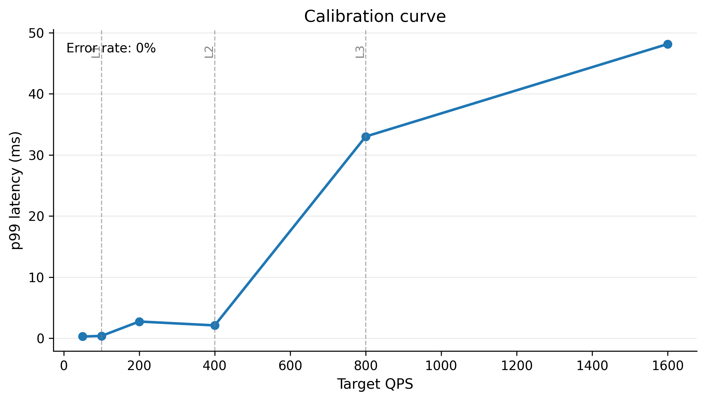
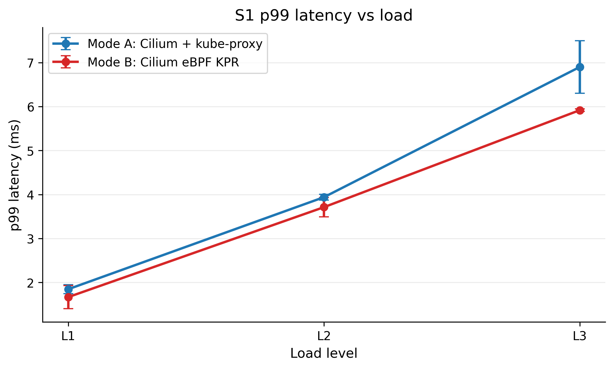
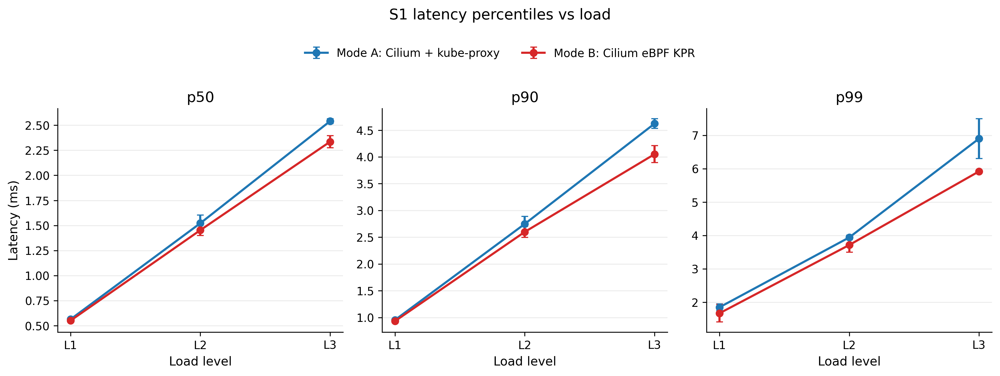
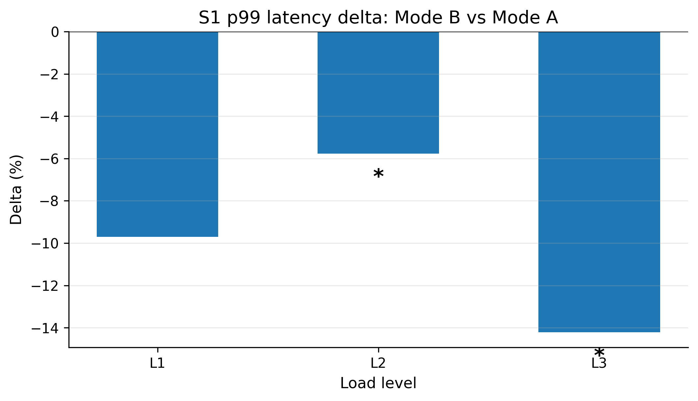
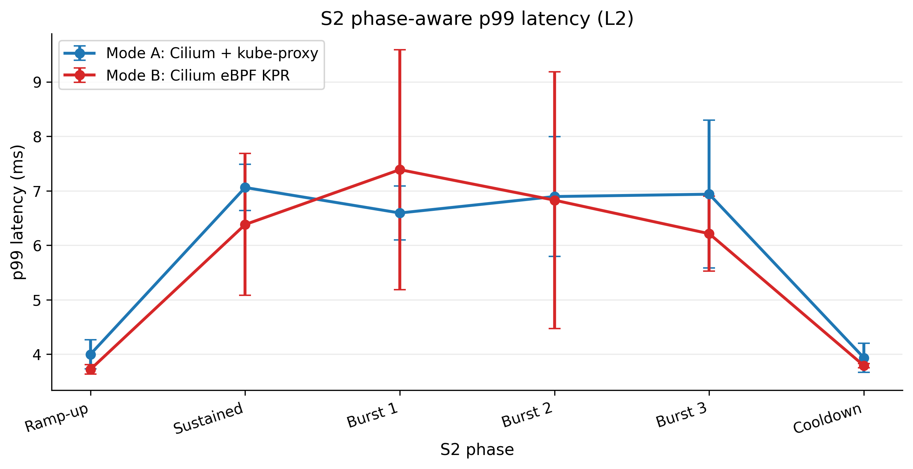
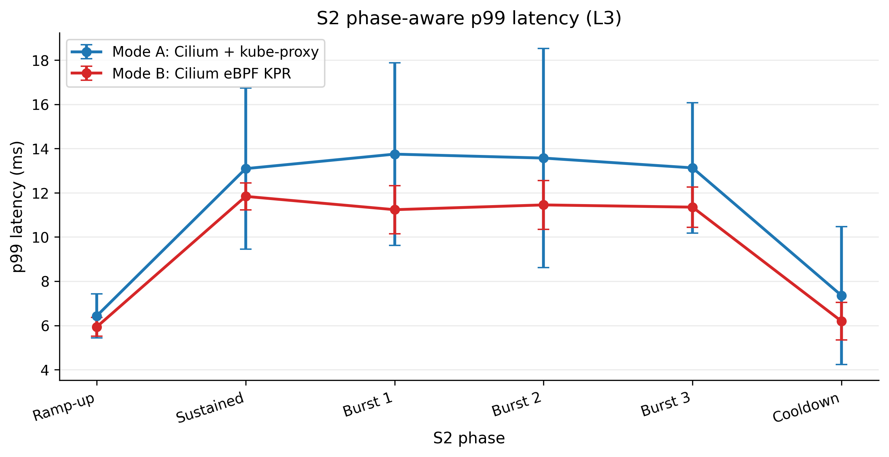
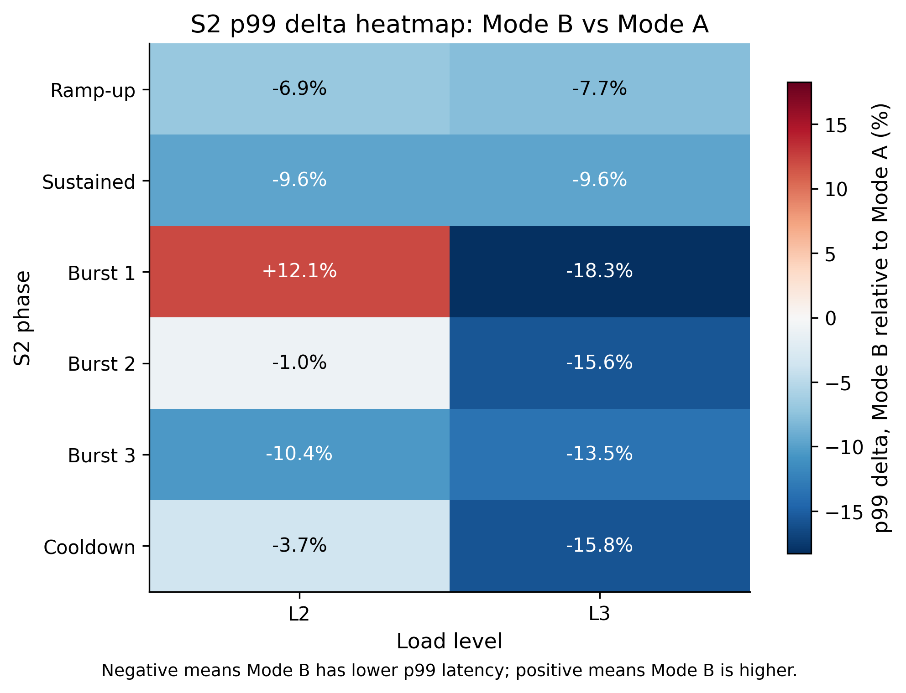
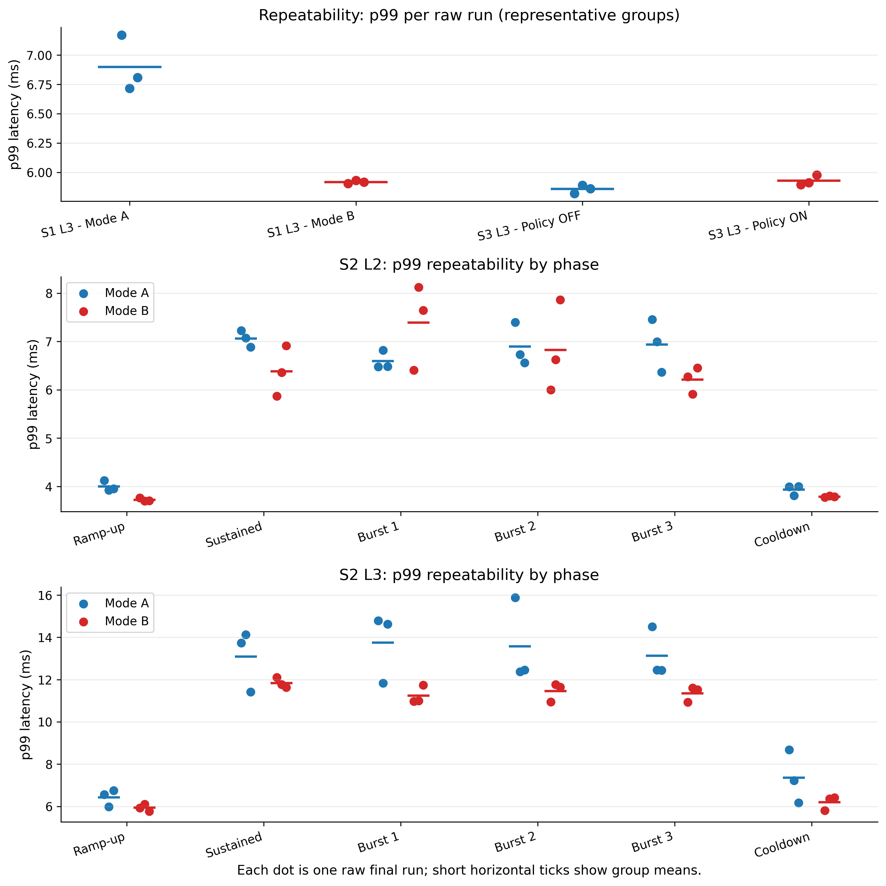

# Phân tích tổng hợp các biểu đồ benchmark

## 1. Giới thiệu

Tài liệu này là nguồn phân tích chính cho các biểu đồ dùng trong thesis/report của benchmark Kubernetes network performance. Mục tiêu không chỉ là mô tả hình, mà còn giải thích hình theo góc nhìn đánh giá hiệu năng mạng: workload nào đang được đo, metric nào được dùng, kết quả trực quan nói gì, số liệu CSV/raw data hỗ trợ đến đâu, và điều gì không nên kết luận quá mức.

Các nguồn đã dùng để đối chiếu:

- `results_analysis/aggregated_summary.csv`
- `results_analysis/comparison_AB.csv`
- `results_analysis/repeatability_summary.csv`
- `results_analysis/calibration_load_selection.csv`
- raw final Fortio artifacts trong `results/mode=A_kube-proxy/`
- raw final Fortio artifacts trong `results/mode=B_cilium-ebpfkpr/`

Nguyên tắc đọc hình:

- `p99` được xem là metric chính cho tail latency.
- `p50` và `p90` giúp kiểm tra liệu xu hướng chỉ xuất hiện ở tail hay nhất quán trên phân phối.
- CI/error bars thể hiện bất định giữa các run; nếu CI chồng lấn hoặc `significant = NO`, cần viết theo hướng thận trọng.
- S2 phải được đọc theo phase, không gộp ramp-up, sustained, burst và cooldown vào một nhóm.
- S3 là so sánh policy OFF vs policy ON trong Mode B, không phải Mode A vs Mode B.
- Với `n = 3`, repeatability/CV chỉ mô tả dataset hiện tại, không đủ để tuyên bố phân phối thống kê đầy đủ.

## 2. Figure: `fig-calibration-curve`



### Biểu đồ đang thể hiện gì

Biểu đồ này thể hiện kết quả calibration sweep trước benchmark chính. Trục x là target QPS, trục y là p99 latency tính bằng millisecond. Các vạch dọc đánh dấu các mức tải được dùng trong benchmark chính: `L1`, `L2`, `L3`.

Đây không phải hình so sánh Mode A với Mode B. Calibration được dùng để chọn mức tải sao cho benchmark có ba vùng dễ diễn giải: nhẹ, trung bình và tải cao.

### Số liệu chính

| QPS | Conns | p99 | Achieved RPS | Error rate | Vai trò |
| ---: | ---: | ---: | ---: | ---: | --- |
| 100 | 8 | 0.385 ms | 100.000 | 0.000% | Final L1 |
| 400 | 32 | 2.107 ms | 400.000 | 0.000% | Final L2 |
| 800 | 64 | 33.006 ms | 799.900 | 0.000% | Final L3 |
| 1600 | 64 | 48.135 ms | 1599.950 | 0.000% | Upper stress point, không dùng làm L3 final |

### Diễn giải kết quả

Ở 100 QPS, p99 chỉ khoảng 0.385 ms. Đây là vùng tải nhẹ, phù hợp làm `L1` vì tail latency thấp và error rate bằng 0. Ở 400 QPS, p99 tăng lên khoảng 2.107 ms. Đây là mức tải trung bình đủ để latency bắt đầu có tail rõ hơn nhưng chưa có lỗi.

Điểm đáng chú ý là từ 400 QPS lên 800 QPS, p99 tăng mạnh từ khoảng 2.107 ms lên 33.006 ms. Đây là dấu hiệu tail latency spike, cho thấy hệ thống bắt đầu chịu áp lực rõ hơn ở phần đuôi phân phối. Tuy nhiên, achieved RPS vẫn gần target và error rate vẫn 0%, nên không thể gọi đây là saturation point tuyệt đối.

Calibration còn có điểm 1600 QPS với p99 khoảng 48.135 ms. Điểm này cao hơn 800 QPS, nhưng final benchmark không chọn 1600 làm `L3`. Cách chọn 800 QPS là hợp lý cho benchmark chính vì 800 đã tạo tail spike rõ rệt nhưng vẫn giữ phép đo usable cho S1/S2/S3. Nếu dùng 1600 làm base L3, S2 burst có thể lên khoảng 2400 QPS, dễ làm kết quả bị chi phối bởi stress cực cao hơn là so sánh datapath một cách ổn định.

### Kết luận an toàn

Kết luận thực tế: các mức tải không được chọn tùy ý; chúng được chọn từ calibration sweep.

Kết luận thesis-safe: `L1 = 100 QPS`, `L2 = 400 QPS`, và `L3 = 800 QPS` đại diện cho light, medium và high-stress/tail-spike load. `L3` không nên được gọi là ngưỡng bão hòa cứng.

Không nên overclaim:

- Không viết "`800 QPS` là saturation point chính xác".
- Không viết "`1600 QPS` bị lỗi nên không dùng"; dữ liệu cho thấy error rate vẫn 0%.
- Không suy luận CPU saturation vì dữ liệu CPU/node metrics không có đủ bằng chứng usable.

## 3. Figure: `fig-s1-p99-vs-load`



### Biểu đồ đang thể hiện gì

Biểu đồ này so sánh p99 latency của S1 giữa Mode A và Mode B theo các mức tải `L1`, `L2`, `L3`. Trục x là load level có thứ tự tăng dần. Trục y là p99 latency tính bằng millisecond. Mỗi đường biểu diễn một mode.

S1 là steady-state benchmark: workload giữ QPS tương đối ổn định trong measurement window. Vì vậy, hình này trả lời câu hỏi: khi tải tăng dần trong điều kiện steady-state, Mode B có giảm tail latency so với Mode A không?

### Số liệu chính

| Load | Mode A p99 | Mode B p99 | Delta B vs A | p-value | Significant |
| --- | ---: | ---: | ---: | ---: | --- |
| L1 | 1.846 ms | 1.667 ms | -9.702% | 0.0838 | NO |
| L2 | 3.939 ms | 3.712 ms | -5.766% | 0.0377 | YES |
| L3 | 6.899 ms | 5.917 ms | -14.223% | 0.0191 | YES |

### Diễn giải kết quả

Cả Mode A và Mode B đều có p99 tăng khi load tăng. Đây là xu hướng kỳ vọng: khi request rate tăng, tail latency thường tăng do queueing, scheduling, network stack overhead hoặc biến động hệ thống.

Mode B có mean p99 thấp hơn Mode A ở cả L1, L2 và L3. Khoảng cách trực quan rõ nhất ở L3, nơi Mode B thấp hơn Mode A khoảng 14.2%. Ở L2, mức giảm nhỏ hơn nhưng vẫn được pipeline đánh dấu significant. Ở L1, mean của Mode B vẫn thấp hơn nhưng `significant = NO`, nên không nên xem L1 là bằng chứng thống kê mạnh.

Error bars cho thấy độ bất định giữa các run. Khi error bars chồng lấn hoặc p-value không đủ mạnh, nên dùng cách viết "xu hướng" thay vì khẳng định chắc chắn.

### Kết luận an toàn

Kết luận thực tế: trong S1, Mode B có p99 thấp hơn Mode A, với lợi ích rõ hơn ở tải cao.

Kết luận thesis-safe: S1 cho thấy Mode B giảm mean p99 ở tất cả load levels; bằng chứng mạnh hơn ở L2 và L3, trong khi L1 chỉ nên diễn giải là xu hướng.

Không nên overclaim:

- Không viết Mode B cải thiện p99 có ý nghĩa thống kê ở mọi mức tải.
- Không dùng riêng hình này để kết luận nguyên nhân cơ chế nếu không liên hệ với thiết lập datapath.

## 4. Figure: `fig-s1-latency-small-multiples`



### Biểu đồ đang thể hiện gì

Hình này tách S1 latency thành ba panel: p50, p90 và p99. Trục x là `L1`, `L2`, `L3`; trục y là latency theo millisecond. Mỗi panel so sánh Mode A với Mode B cho một percentile.

Mục tiêu của hình là kiểm tra xem lợi thế của Mode B chỉ xuất hiện ở tail hay có tính nhất quán trên nhiều phần của phân phối latency.

### Số liệu chính

| Load | Metric | Mode A | Mode B | Delta B vs A | Significant |
| --- | --- | ---: | ---: | ---: | --- |
| L1 | p50 | 0.564 ms | 0.551 ms | -2.410% | YES |
| L1 | p90 | 0.953 ms | 0.932 ms | -2.214% | YES |
| L1 | p99 | 1.846 ms | 1.667 ms | -9.702% | NO |
| L2 | p50 | 1.522 ms | 1.453 ms | -4.548% | YES |
| L2 | p90 | 2.748 ms | 2.599 ms | -5.405% | YES |
| L2 | p99 | 3.939 ms | 3.712 ms | -5.766% | YES |
| L3 | p50 | 2.540 ms | 2.335 ms | -8.043% | YES |
| L3 | p90 | 4.622 ms | 4.051 ms | -12.362% | YES |
| L3 | p99 | 6.899 ms | 5.917 ms | -14.223% | YES |

### Diễn giải kết quả

Ba panel đều cho thấy latency tăng khi load tăng. Điều này xác nhận benchmark đang tạo áp lực tăng dần lên hệ thống. Mode B nằm thấp hơn Mode A ở cả p50, p90 và p99 về mean, nghĩa là xu hướng không chỉ xuất hiện ở một percentile đơn lẻ.

Ở L3, mức giảm tương đối lớn hơn, đặc biệt ở p90 và p99. Điều này quan trọng vì khi tải cao, phần đuôi phân phối thường phản ánh rõ hơn overhead của datapath. Nếu Mode B giữ p90/p99 thấp hơn ở L3, đó là dấu hiệu có lợi về tail latency trong steady-state.

Tuy nhiên, p99 ở L1 không significant. Vì vậy, hình này nên được dùng để nói về xu hướng nhất quán của mean latency, còn các kết luận thống kê phải dựa vào từng metric/load cụ thể.

### Kết luận an toàn

Kết luận thực tế: Mode B có latency thấp hơn Mode A trên nhiều percentile trong S1, nhất là khi tải tăng.

Kết luận thesis-safe: S1 cho thấy xu hướng nhất quán có lợi cho Mode B trên p50/p90/p99, nhưng cần phân biệt điểm nào significant và điểm nào chỉ là xu hướng.

Không nên overclaim:

- Không viết mọi percentile ở mọi load đều có bằng chứng thống kê mạnh nếu p99 L1 không significant.
- Không dùng p50 để thay thế p99 khi bàn về tail latency.

## 5. Figure: `fig-s1-delta-p99`



### Biểu đồ đang thể hiện gì

Hình này biểu diễn delta phần trăm của p99 trong S1: Mode B so với Mode A. Trục x là load level. Trục y là delta %. Giá trị âm nghĩa là Mode B có p99 thấp hơn Mode A.

Dấu `*` thể hiện các điểm được pipeline đánh dấu `significant = YES`.

### Diễn giải kết quả

Cả ba cột đều âm, nghĩa là mean p99 của Mode B thấp hơn Mode A ở L1, L2 và L3. L3 có delta lớn nhất, khoảng -14.2%, và được đánh dấu significant. L2 giảm khoảng -5.8% và cũng significant. L1 giảm khoảng -9.7% nhưng không significant, nên cần diễn giải thận trọng.

Hình delta rất phù hợp cho presentation vì người xem thấy ngay hướng thay đổi. Tuy nhiên, delta % có thể che mất giá trị tuyệt đối và độ bất định. Vì vậy, nó nên được đọc cùng `fig-s1-p99-vs-load`.

### Kết luận an toàn

Kết luận thực tế: S1 p99 delta cho thấy Mode B có lợi thế tail latency, rõ nhất ở L3.

Kết luận thesis-safe: delta p99 ủng hộ nhận định Mode B giảm tail latency ở L2 và L3 theo output thống kê hiện tại; L1 là xu hướng nhưng chưa đủ mạnh về significance.

Không nên overclaim:

- Không viết chỉ dựa vào cột âm rằng mọi load đều significant.
- Không dùng delta % mà bỏ qua CI và p-value.

## 6. Figure: `fig-s2-phase-p99-l2`



### Biểu đồ đang thể hiện gì

Hình này so sánh p99 latency của S2 ở load `L2`, theo từng phase: Ramp-up, Sustained, Burst 1, Burst 2, Burst 3 và Cooldown. Trục x là phase của workload. Trục y là p99 latency. Hai đường biểu diễn Mode A và Mode B.

S2 là workload có connection churn và burst. Vì vậy, hình này không nên được thay bằng một mean tổng cho toàn bộ S2.

### Diễn giải phase-by-phase

**Ramp-up.** Mode B thấp hơn Mode A: 3.721 ms so với 3.998 ms, delta khoảng -6.9%, và dòng này được đánh dấu significant. Đây là phase nhẹ hơn, có thể phản ánh lợi thế ban đầu của Mode B khi workload chưa bước vào burst.

**Sustained.** Mode B thấp hơn Mode A: 6.381 ms so với 7.061 ms, delta khoảng -9.6%, nhưng `significant = NO`. Có xu hướng tốt cho Mode B, nhưng không nên viết là kết luận thống kê mạnh.

**Burst 1.** Đây là ngoại lệ quan trọng. Mode B cao hơn Mode A: 7.389 ms so với 6.593 ms, delta +12.1%, `significant = NO`. Điều này cho thấy Mode B không thắng nhất quán ở mọi burst phase. Nên diễn giải là một quan sát trong dataset, không phải bằng chứng tổng quát rằng Mode B kém hơn dưới burst.

**Burst 2.** Mode B gần như bằng Mode A: 6.828 ms so với 6.895 ms, delta -1.0%. Khác biệt quá nhỏ để có ý nghĩa thực tế mạnh.

**Burst 3.** Mode B thấp hơn Mode A: 6.213 ms so với 6.938 ms, delta -10.4%, nhưng không significant. Đây là xu hướng có lợi cho Mode B, nhưng vẫn cần thận trọng.

**Cooldown.** Mode B thấp hơn nhẹ: 3.789 ms so với 3.933 ms, delta -3.7%, không significant. Phase cooldown quay lại mức latency thấp hơn sustained/burst, đúng kỳ vọng sau khi tải giảm.

### Kết luận an toàn

Kết luận thực tế: ở S2 L2, Mode B thường có mean p99 thấp hơn, nhưng không ổn định qua mọi phase; Burst 1 là ngoại lệ.

Kết luận thesis-safe: S2 L2 cho thấy tính phase-dependent rõ rệt. Không nên gộp toàn bộ S2 L2 thành một kết luận duy nhất.

Không nên overclaim:

- Không viết Mode B cải thiện toàn bộ S2 L2.
- Không bỏ qua Burst 1 chỉ vì phần lớn phase còn lại có delta âm.

## 7. Figure: `fig-s2-phase-p99-l3`



### Biểu đồ đang thể hiện gì

Hình này là phiên bản S2 phase-aware tại `L3`. Trục x là các phase của S2. Trục y là p99 latency. Hai đường so sánh Mode A và Mode B.

`L3` là mức tải cao, nên hình này giúp đánh giá xem khi workload nặng hơn, khác biệt giữa datapath có rõ hơn không.

### Diễn giải phase-by-phase

**Ramp-up.** Mode B thấp hơn Mode A: 5.934 ms so với 6.431 ms, delta -7.7%. Đây là khác biệt vừa phải và không significant. Nó cho thấy Mode B có xu hướng tốt hơn ngay từ phase đầu, nhưng chưa đủ để kết luận mạnh.

**Sustained.** Mode B thấp hơn: 11.839 ms so với 13.094 ms, delta -9.6%. Đây là phase có tải cao ổn định, nên mức giảm này có ý nghĩa thực tế đáng chú ý. Tuy nhiên, `significant = NO`, do đó chỉ nên viết là xu hướng mean.

**Burst 1.** Mode B thấp hơn rõ về mean: 11.237 ms so với 13.750 ms, delta -18.3%. Đây là một trong các điểm mạnh nhất về mặt trực quan của S2 L3. Tuy nhiên, p-value chưa đủ để đánh dấu significant, nên không được gọi là bằng chứng thống kê chắc chắn.

**Burst 2.** Mode B tiếp tục thấp hơn: 11.453 ms so với 13.572 ms, delta -15.6%. Đây là xu hướng nhất quán với Burst 1, nhưng vẫn cần đọc cùng repeatability vì Mode A ở S2 L3 Burst 2 có CV cao.

**Burst 3.** Mode B thấp hơn: 11.352 ms so với 13.129 ms, delta -13.5%. Burst 3 củng cố mô hình chung ở L3: Mode B có mean p99 thấp hơn trong burst.

**Cooldown.** Mode B thấp hơn: 6.193 ms so với 7.355 ms, delta -15.8%. Cooldown cho thấy sau burst, p99 giảm xuống nhưng Mode A vẫn biến động hơn Mode B trong dataset này.

### Kết luận an toàn

Kết luận thực tế: S2 L3 là nơi Mode B có xu hướng mean p99 thấp hơn rõ nhất qua toàn bộ phase, đặc biệt trong burst/cooldown.

Kết luận thesis-safe: dữ liệu S2 L3 ủng hộ nhận định Mode B có lợi thế tail latency trong workload phase-aware ở tải cao, nhưng vì các phase không được đánh dấu significant, cần dùng ngôn ngữ "xu hướng" thay vì khẳng định tuyệt đối.

Không nên overclaim:

- Không viết Mode B cải thiện S2 L3 có ý nghĩa thống kê ở mọi phase.
- Không bỏ qua variance cao của Mode A trong một số phase.

## 8. Figure: `fig-s2-p99-delta-heatmap`



### Biểu đồ đang thể hiện gì

Heatmap này tóm tắt delta p99 của Mode B so với Mode A theo cả load và phase. Hàng là phase, cột là `L2` và `L3`. Mỗi ô là delta %, tính trực tiếp từ raw final S2 Fortio JSON:

```text
delta_pct = (p99_mean_Mode_B - p99_mean_Mode_A) / p99_mean_Mode_A * 100
```

Giá trị âm nghĩa là Mode B có p99 thấp hơn Mode A. Giá trị dương nghĩa là Mode B cao hơn.

### Diễn giải phase-by-phase

**Ramp-up.** Cả L2 và L3 đều âm: -6.9% và -7.7%. Mode B có xu hướng thấp hơn ở giai đoạn đầu của workload.

**Sustained.** Cả L2 và L3 đều khoảng -9.6%. Đây là xu hướng nhất quán trong phase tải cao ổn định, nhưng không nên overclaim vì các dòng sustained không significant.

**Burst 1.** L2 là ngoại lệ dương +12.1%, còn L3 là -18.3%. Điều này cho thấy hành vi burst không đồng nhất giữa mức tải. L2 Burst 1 cần được nêu rõ như một điểm thận trọng.

**Burst 2.** L2 gần như không khác biệt (-1.0%), trong khi L3 giảm -15.6%. Điều này cho thấy lợi thế của Mode B rõ hơn ở tải cao.

**Burst 3.** L2 giảm -10.4%, L3 giảm -13.5%. Đây là phase củng cố xu hướng Mode B thấp hơn trong burst, nhưng vẫn cần đọc cùng CI/repeatability.

**Cooldown.** L2 giảm nhẹ -3.7%, L3 giảm mạnh hơn -15.8%. Cooldown ở L3 cho thấy Mode B có mean p99 thấp hơn sau burst, nhưng Mode A có variance cao hơn nên cần diễn giải thận trọng.

### Kết luận an toàn

Kết luận thực tế: heatmap cho thấy Mode B có p99 thấp hơn ở phần lớn ô, đặc biệt tại L3.

Kết luận thesis-safe: S2 heatmap hỗ trợ luận điểm rằng lợi thế của Mode B rõ hơn dưới tải cao và burst/churn, nhưng S2 L2 có ngoại lệ và phần lớn phase không significant.

Không nên overclaim:

- Không viết "Mode B luôn tốt hơn trong S2".
- Không dùng màu xanh/đỏ như bằng chứng significance.
- Không bỏ qua `L2 Burst 1`.

## 9. Figure: `fig-repeatability-p99-dotplot`



### Biểu đồ đang thể hiện gì

Hình này đánh giá repeatability/stability của benchmark. Mỗi dot là một raw final run. Vạch ngang ngắn là mean p99 của nhóm. Hình không dùng boxplot vì mỗi nhóm chỉ có `n = 3`, không đủ để biểu diễn phân phối một cách giàu ý nghĩa.

Panel đầu so sánh các nhóm đại diện S1 L3 và S3 L3. Hai panel sau phân tích S2 L2 và S2 L3 theo phase.

### Diễn giải kết quả

Các nhóm ổn định nhất:

| Group | CV p99 |
| --- | ---: |
| S1 L3 Mode B | 0.212% |
| S3 L3 Policy OFF | 0.598% |
| S3 L3 Policy ON | 0.744% |
| S2 L2 Cooldown Mode B | 0.392% |
| S2 L2 Ramp-up Mode B | 0.937% |

Các nhóm biến động cao hơn:

| Group | CV p99 |
| --- | ---: |
| S2 L3 Cooldown Mode A | 17.092% |
| S2 L3 Burst 2 Mode A | 14.702% |
| S2 L3 Burst 1 Mode A | 12.089% |
| S2 L2 Burst 2 Mode B | 13.896% |
| S2 L2 Burst 1 Mode B | 11.996% |

Hình cho thấy S1 L3 Mode B và S3 L3 có các dot gần nhau, tức repeatability tốt trong dataset hiện tại. Ngược lại, S2 có các dot phân tán hơn, đặc biệt ở các phase burst/cooldown. Điều này phù hợp với bản chất của S2: workload có phase, burst và connection churn dễ làm tail latency biến động hơn steady-state.

### Ý nghĩa cho benchmark rigor

Repeatability analysis giúp thesis tránh chỉ dựa vào mean. Nếu một nhóm có mean tốt hơn nhưng CV cao, kết luận cần thận trọng hơn. Đối với S2, dot plot củng cố quyết định phân tích theo phase và dùng CI/delta thay vì gộp toàn bộ.

### Kết luận an toàn

Kết luận thực tế: S1/S3 đại diện có repeatability tốt; S2 biến động cao hơn, nhất là burst/cooldown.

Kết luận thesis-safe: benchmark có độ lặp lại tương đối tốt trong các nhóm steady/policy, nhưng S2 cần được diễn giải thận trọng vì biến động run-to-run cao hơn.

Không nên overclaim:

- Không viết CV với `n = 3` là ước lượng phương sai đầy đủ.
- Không viết mọi phase S2 đều unstable.
- Không dùng dot plot thay thế kiểm định thống kê.

## 10. Figure: `fig-s3-policy-overhead-p99`


### Biểu đồ đang thể hiện gì

Hình này so sánh p99 latency trong S3 giữa policy OFF và policy ON, chỉ trong Mode B. Đây không phải so sánh Mode A với Mode B.

Trục x là load level `L2` và `L3`. Trục y là p99 latency. OFF và ON được vẽ bằng marker lệch nhau để tránh che nhau. Đây là hình chính của S3 vì p99 phản ánh tail latency của allowed traffic khi NetworkPolicy được bật.

### Số liệu chính

| Load | Policy OFF p99 | Policy ON p99 | Delta ON vs OFF |
| --- | ---: | ---: | ---: |
| L2 | 3.747 ms | 3.619 ms | -3.4% |
| L3 | 5.857 ms | 5.928 ms | +1.2% |

### Diễn giải kết quả

Ở L2, policy ON có mean p99 thấp hơn OFF một chút. Không nên diễn giải điều này là policy làm latency tốt hơn; hợp lý hơn là xem đây là biến động đo lường giữa các run.

Ở L3, policy ON cao hơn OFF rất nhẹ, khoảng +1.2%. Mức tăng này nhỏ về mặt thực tế. CI giữa OFF và ON chồng lấn, và các kiểm tra phụ trợ trước đó không cho thấy bằng chứng significant mạnh.

Điểm quan trọng là không có dấu hiệu policy ON làm p99 tăng mạnh trong dataset hiện tại. Nhưng điều đó chỉ đúng cho policy đơn giản và traffic pattern đã đo.

### Kết luận an toàn

Kết luận thực tế: trong S3, bật policy không tạo overhead p99 đáng kể trong dữ liệu hiện tại.

Kết luận thesis-safe: với CiliumNetworkPolicy đơn giản cho allowed Fortio-to-echo traffic, p99 latency của Mode B gần như không đổi giữa OFF và ON ở L2/L3.

Không nên overclaim:

- Không viết NetworkPolicy nói chung không có overhead.
- Không mở rộng kết luận sang policy phức tạp hơn, nhiều rule hơn hoặc workload khác.

## 11. Figure: `fig-s3-policy-overhead-rps`


### Biểu đồ đang thể hiện gì

Hình này so sánh achieved RPS giữa policy OFF và ON trong S3. Đây là supporting evidence cho p99 figure. Trục y là RPS, trục x là OFF/ON, và hình được chia panel theo load để tránh việc hai series gần như trùng nhau che mất nhau.

### Số liệu chính

| Load | Policy OFF RPS | Policy ON RPS | Error rate |
| --- | ---: | ---: | ---: |
| L2 | 399.992 | 399.992 | 0.0% |
| L3 | 799.974 | 799.965 | 0.0% |

### Diễn giải kết quả

RPS gần như không đổi khi bật policy. Ở L2, OFF và ON hầu như giống nhau. Ở L3, ON thấp hơn OFF khoảng 0.009 RPS, tức khác biệt không có ý nghĩa thực tế trong bối cảnh target 800 QPS.

Hình RPS có vai trò xác nhận rằng policy ON không làm benchmark bị under-driving hoặc mất throughput quan sát được. Tuy nhiên, vì kết quả RPS gần như trùng nhau, hình này không mạnh bằng p99 figure. Trong thesis ngắn, RPS có thể đưa vào bảng hoặc appendix.

### Hubble/policy evidence liên quan

S3 evidence hỗ trợ các claim sau:

- CiliumNetworkPolicy tồn tại và active.
- Allowed Fortio-to-echo traffic vẫn trả HTTP 200.
- Attacker deny-case có timeout/fail.
- Hubble final flows có `FORWARDED` và `TRACED`.

Evidence hiện tại không đủ để claim mạnh rằng Hubble chứng minh `DROPPED` verdict, vì final Hubble flows không có bằng chứng DROPPED rõ và ring buffer có dấu hiệu đầy/lost events.

### Kết luận an toàn

Kết luận thực tế: policy ON không làm giảm achieved RPS trong dataset hiện tại.

Kết luận thesis-safe: RPS figure hỗ trợ nhận định overhead policy nhỏ, nhưng kết luận chính của S3 nên dựa vào p99 và evidence policy, không chỉ RPS.

Không nên overclaim:

- Không viết RPS giống nhau nghĩa là policy không có overhead trong mọi khía cạnh.
- Không claim DROPPED evidence nếu artifact không hỗ trợ.

## 12. Tổng hợp kết luận thesis-safe

Các kết luận có thể dùng:

1. Calibration cho thấy load levels được chọn dựa trên dữ liệu. `L3 = 800 QPS` là high-stress/tail-spike point, không phải saturation point tuyệt đối.
2. S1 cho thấy Mode B có mean latency thấp hơn Mode A ở p50/p90/p99, với bằng chứng mạnh hơn tại L2/L3.
3. S2 cho thấy hành vi phụ thuộc phase. Mode B có xu hướng p99 thấp hơn ở nhiều phase, đặc biệt ở L3, nhưng không thắng nhất quán mọi phase và không phải mọi phase đều significant.
4. Repeatability cho thấy S1/S3 ổn định hơn S2; do đó S2 cần được diễn giải theo phase và kèm lưu ý về variance.
5. S3 cho thấy NetworkPolicy ON không tạo overhead p99/RPS đáng kể trong dataset hiện tại, nhưng chỉ trong phạm vi policy đơn giản và workload đã đo.

## 13. Các điểm không nên overclaim

Không nên viết:

- "Mode B luôn tốt hơn Mode A trong mọi scenario."
- "L3 là saturation point chính xác."
- "S2 chứng minh Mode B cải thiện có ý nghĩa thống kê ở mọi phase."
- "NetworkPolicy không có overhead trong mọi trường hợp."
- "Hubble chứng minh DROPPED verdict nếu artifact không có DROPPED evidence rõ."
- "CV với n=3 là ước lượng phương sai đầy đủ của hệ thống."

Nên viết:

- "Mode B có xu hướng giảm latency, đặc biệt trong S1 L2/L3 và nhiều phase S2 L3."
- "L3 là high-load/tail-spike point được chọn từ calibration."
- "S2 cần phân tích phase-aware vì burst/churn tạo hành vi tail latency khác với steady-state."
- "S3 cho thấy overhead policy nhỏ trong phạm vi policy đơn giản và workload hiện tại."
- "Repeatability analysis hỗ trợ đánh giá độ ổn định nhưng vẫn bị giới hạn bởi n=3."
